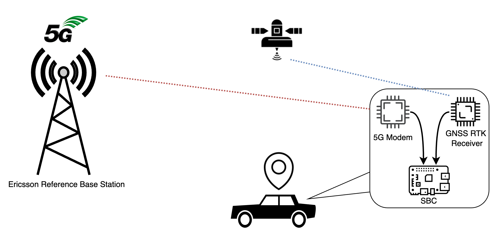
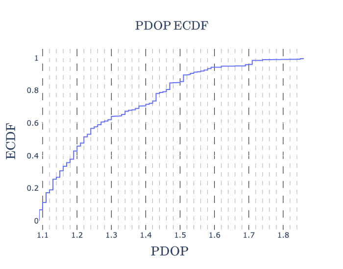

# GNSS RTK ROS1/2 Package for Ublox F9P with Ericsson stations

Authors: [Emanuele Pagliari](https://github.com/Palia95) and  [Yosri Fersi](https://github.com/Yosri-Fersi)

The following ROS1/2 package enables the usage of GNSS RTK with GNSS corrections provided by the Ericsson base stations available in Sweden. The package has been built to be used with the Ublox F9P RTK GNSS receiver and needs an internet connection in order to reach the base stations to retrieve the corrections. ROS2 package is available in the ROS2 branch.

## GNSS RTK architecture

GNSS RTK is a technique used to enhance the accuracy of positioning provided by satellite navigation systems, which exploits the comparison between the phase of the carrier wave between a reference station, with known coordinates, and a rover-mounted GNSS receiver at an unknown location. By measuring the phase difference, RTK can determine the rover's position with centimeter-level accuracy in real-time. To achieve this high accuracy, RTK relies on the transmission of correction data from the reference station to the rover. There are several correction modes used in RTK, among them, the most common are:

* Observation Space Representation (OSR): OSR directly utilises GNSS measurements like pseudo-range and carrier phase observations to estimate the rover's position relative to the reference station. This approach offers a straightforward and computationally efficient means to achieve high-precision positioning in real-time.

* State Space Representation (SSR): SSR formulates the RTK positioning problem as a state space model, with the state vector representing unknowns like the rover's position, velocity, clock biases, and atmospheric delays. SSR is favored for its ability to provide robust and accurate positioning solutions, especially in advanced RTK implementations and network-based RTK services.

An generic overview of GNSS RTK architecture is depicted in the following scheme.



## Hardware Requirements

In order to use the GNSS RTK, it is needed a suitable GNSS receiver, preferably based on the Ublox F9P. In our lab, the [ArduSimple RTK2B](https://www.ardusimple.com/product/simplertk2b/?attribute_pa_header-options=without-headers) with an [Eliptical Dual Band antenna](https://www.ardusimple.com/product/helical-antenna/) has been used. The module must be connected through the USB serial port to the companion computer onboard of the target platform.

In order to get the GNSS corrections, the companion computer must be connected to internet. Any connection is fine, it can be Wi-Fi, 4G or even 5G. In a mobile platform, it is warmly suggested to use a 4G/5G plug and play modem.

Finally, the antenna of the GNSS receiver must be located in a obstacles-free position on the platform, possible away form electrical wires, motors and carbon fibre frame parts.

## Compilation

* First install the dependencies of the Ericsson client:
```bash
sudo apt install g++ cmake libssl-dev ninja-build
```

* Then, once the repository has been cloned into your ROS1 workspace, you can recompile it using `ninja` instead of `gcc` with the following command:
```bash
catkin_make --use-ninja
```
* If there are issues compiling, temporarily remove the Ericsson client files folder in the `src/ublox_ros` with name `SUPL-3GPP-LPP-client-main`, clean the workspace and recompile it as mentioned before.

## Installation

* If there is no need to recompile the ROS1/2 package, it is just possible to clone this repository in your ROS1/2 workspace;

* Once cloned, connect the GNSS RTK module and then lunch the script in the main folder:
```bash
sudo bash gnss_rtk_exec.sh
```

* In a few seconds, the client will connect to Ericsson ground station and then the ROS publisher will start publishing the positioning informations in the proper ROS topic:
```bash
/ublox_client
```

## Note

There might be a bug in the altitude, which might be divided or multiplied by 10. Therefore, if you need the altitude, remember to check and properly divide or multiply it by 10.

## Performance

The experiment has been conducted at the LTU facility to verify both the accuracy and reliability of the GNSS RTK solution in an environment with both clear sky views and obstacles such as tall trees and narrow passages between buildings. The performance has been evaluated based on the Position Dilution of Precision (`PDOP`) retrieved from the GNSS RTK module. `PDOP` is a measure that indicates the quality of the positioning solution, with lower values representing better accuracy. For GNSS RTK positioning applications:

- A `PDOP` value of 1 is considered ideal, allowing for the highest possible confidence level.
- A `PDOP` value between 1 and 2 is considered excellent, providing accuracy sufficient for most applications.
- A `PDOP` value between 2 and 5 is still considered good, representing the minimum level suitable for centimeter-level positional accuracy typical of GNSS RTK systems.

According to the Ublox F9P documentation and the geographical distance between the reference station and the rover, it is possible to compute the Circular Error Probability (`CEP`) of the adopted system as follows:
```bash
CEP = 0.01 [m] + D [m] x 1 [ppm]
```
where D is the geographical distance between the reference station and the rover, which in our case, is approximately equal to 4000 m; 0.01 is the `CEP` of the Ublox F9P, and 1 is the additional `CEP` in parts per million (ppm) due to the distance between the reference station and the rover.

From the CEP obtained from the previous equation, which in our experimental setup is `CEP` = 1.4 cm, together with the PDOP gathered from the RTK GNSS receiver, it is therefore possible to estimate an approximate Position Error (`P_error`) [cm], as detailed in the following:
```bash
    P_error [cm] = CEP x PDOP
```

### Preliminary Results

The preliminary results of the GNSS RTK integration in the wheeled rover are shown in the image below, where a map of LTU is depicted together with both the `PDOP` and the GNSS RTK positions. The marker size of `PDOP` markers is proportional to the `PDOP` values; therefore, wider markers indicate a larger `PDOP` value, resulting in a higher positioning error (`P_error`).


An increase in the `PDOP` can be seen in the circled areas, which are close to tall buildings or trees, thus limiting the sky visibility and increasing the position uncertainty.

### Experimental Cumulative Distribution Function (ECDF)

To better visualize the gathered data, the Experimental Cumulative Distribution Function (ECDF) of both `PDOP` and `P_error` are shown below.

#### ECDF of PDOP during LTU trial


#### ECDF of `P_error` (cm) during LTU trial


### Summary

As visible from the ECDF of `PDOP`, the overall average `PDOP` is 1.29, very close to the ideal value of the `PDOP` quality metric. The 90th percentile position error is 1.53 cm. The maximum measured `PDOP` value is 1.86, and the minimum value is 1.09. These `PDOP` values translate into:
- An average `P_error` of 1.80 cm
- A 90th percentile `P_error` of 2.14 cm
- A minimum `P_error` of 1.52 cm
- A maximum `P_error` of 2.60 cm


## Ericsson RTK client

This ROS1 package is based on the following Ericsson GNSS RTK client [Ericsson GNSS RTK client]([https://github.com/Ericsson/SUPL-3GPP-LPP-client]).
